<!--
  <<< PROFESSIONAL GITHUB PROFILE README >>>
  Theme: Tokyo Night / Modern Dark
  Author: Girisudhan Venkatesh
-->

<!-- HEADER & BANNER -->
<!-- HEADER & BANNER -->

  <picture>
    <source media="(prefers-color-scheme: dark)" srcset="./profile.svg">
    <source media="(prefers-color-scheme: light)" srcset="./profile.svg">
    
  </picture>

   

   <!-- Instagram -->
  
&nbsp;&nbsp;&nbsp;
  <!-- LinkedIn -->
  
&nbsp;&nbsp;&nbsp;
  <!-- Gmail -->
  

 

  

<!-- PROFILE STATS -->

  
  
  

## 🧑‍💻 About Me

I am an **Electronics & Communication Engineer** at **Amrita University** driven by the philosophy of **"Debugging hardware, shipping software, learning nonstop"**. I specialize in creating systems where hardware sensors seamlessly communicate with cloud intelligence to solve real-world problems.

Starting with simple **Arduino prototypes**, my journey has evolved into designing complex **IoT architectures** and **scalable web applications**. I don't just write code; I engineer solutions that are efficient, scalable, and user-centric.

- 🏆 Hackathon Winner  
- 🧠 Core Member – Intel IoT Club  
- 🔌 Embedded → 🌐 Cloud → 🤖 AI pipelines

> *“Engineering the Space Between Hardware and Software.”*

---

## 🛠️ Technical Arsenal

  <table width="100%">
    <thead>
      <tr>
        <th width="25%">Category</th>
        <th width="75%">Tech Stack & Tools</th>
      </tr>
    </thead>
    <tbody>
      <tr>
        <td align="center"><strong>🌐 Frontend</strong></td>
        <td>
          
          
          
           
        </td>
      </tr>
      <tr>
        <td align="center"><strong>🧠 Backend & Cloud</strong></td>
        <td>
          
          
          
          
        </td>
      </tr>
      <tr>
        <td align="center"><strong>🤖 IoT & AI</strong></td>
        <td>
          
          
          
          
        </td>
      </tr>
      <tr>
        <td align="center"><strong>🔧 Tools</strong></td>
        <td>
          
          
          
          
        </td>
      </tr>
    </tbody>
  </table>

---

<!-- GITHUB ANALYTICS -->
## 📊 Development Analytics

  <!-- Activity Graph -->
  
    
  

  <table border="0" cellpadding="0" cellspacing="0">
    <tr>
      <td width="410px" align="center">
        
      </td>
      <td width="410px" align="center">
        
      </td>
    </tr>
    <tr>
      <td colspan="2" align="center" style="padding-top: 10px;">
        
      </td>
    </tr>
  </table>

---

<!-- PROJECT SHOWCASE -->
## 🚀 Flagship Projects

### 🎟️ Anokha Techfair Attendance System
A **real-time digital attendance platform** built for **Anokha 2026 Techfair** to replace manual entry systems. Implemented **QR-based scanning using ESP32**, live updates via **Firebase Realtime Database**, secure **PIN-based authentication**, interactive dashboards, analytics, and **Excel export** for offline reporting.

**Tech Stack:**  
`React` · `Vite` · `Firebase RTDB` · `ESP32` · `GSAP` · `Recharts` · `XLSX`

---

### 🚲 Smart Bicycle Locker
A **smart access-controlled bicycle locker system** where I contributed as a **full-stack developer**. Designed and deployed the **authentication and login system**, handled frontend–backend integration, resolved critical bugs, and supported the hardware team to ensure smooth **end-to-end system operation**.

**Tech Stack:**  
`MERN Stack` · `React Native` · `Node.js` · `MongoDB` · `Vite`

---

### 🌫️ AIoT Air Quality Forecaster
An **AIoT-powered air quality forecasting system** deployed on **public transport vehicles** to collect live environmental data across the city. Data is processed using a trained **machine learning model** and visualized on a **real-time web dashboard** for both users and administrators.

**Tech Stack:**  
`Python` · `Machine Learning` · `IoT` · `Web Dashboard`

---

### 🔐 QR Based Door Entry System
A **real-time student verification and access control system** built using **ESP32-CAM** for QR scanning and **Firebase** for live data sync. Integrated a **Flask backend**, Google Sheets, PDF report generation, cooldown logic, and an admin dashboard with **Dark Mode and role-based controls**.

**Tech Stack:**  
`Flask` · `Firebase` · `ESP32-CAM` · `OpenCV` · `Google Sheets API`

---

### 🧭 Mini Mapper
A **navigation assistance system for bikers** where I worked as a **frontend developer**. Built a minimal, power-efficient dashboard that processes routes using **Google Maps / OpenStreetMap APIs** and streams navigation instructions to an **ESP32-powered OLED display**.

**Tech Stack:**  
`HTML` · `Tailwind CSS` · `JavaScript` · `Flask` · `Maps APIs`

---
## 🧩 What Makes Me Different?

✔ Embedded + Web in one brain  
✔ Hardware-aware software design  
✔ Clean architecture mindset  
✔ Real deployments, not demos  

---

## 📌 Current Focus Areas

- ⚡ Edge AI on microcontrollers  
- ☁️ Serverless IoT pipelines  
- 📡 Low-latency communication  
- 🧠 Applied ML systems  

---

<!-- FOOTER -->

   
  <h3>Let's build something amazing together! 🚀</h3>
   
  

